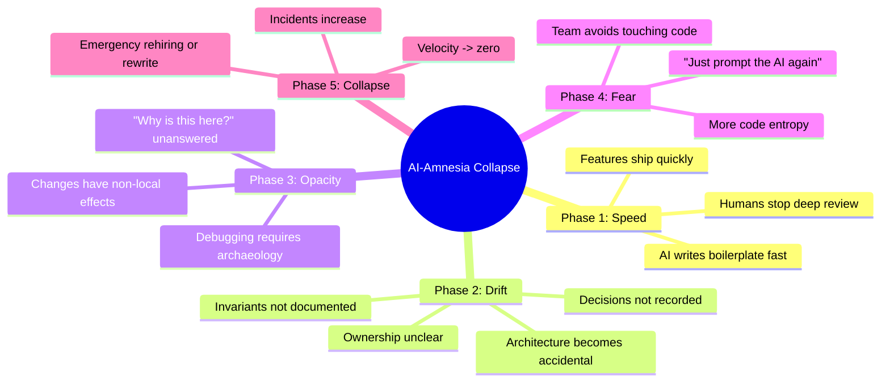
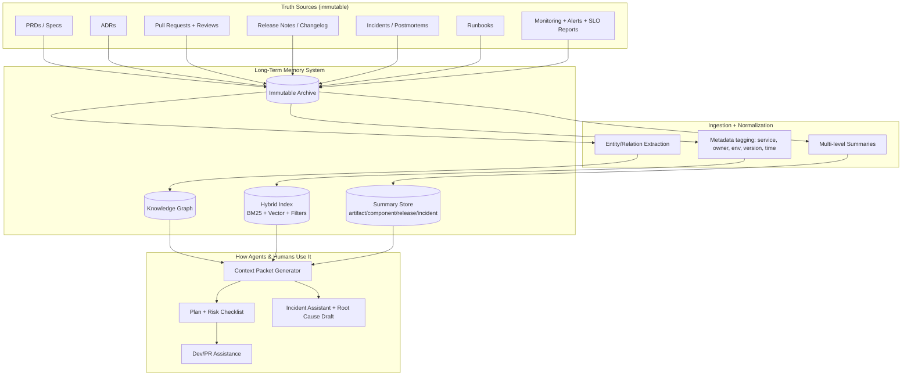
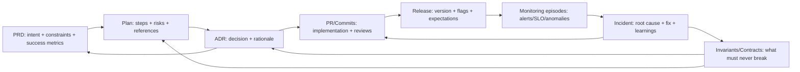

import Head from '@docusaurus/Head';

<Head>
  <link
    rel="canonical"
    href="https://medium.com/@danduh/ai-is-building-code-nobody-can-maintain-youre-next-141fdbfc0b2b"
  />
</Head>

The first sign that something was wrong wasn't an outage.

It was a question.

"Who owns `billing-orchestrator`?" the VP of Engineering asked.

Silence.

People glanced at each other on Zoom. Cameras flicked off. Someone scrolled frantically through a Confluence graveyard. Eventually a staff engineer said what everyone already knew:

> "I think… the AI built most of that."

Cool. So the thing that moves money in and out of the company? Nobody really understands it. But hey, at least it shipped fast.

Welcome to **AI amnesia**: when you successfully automate away your developers and, a few quarters later, realize you also automated away your memory.

{/* truncate */}

> _Originally published on [Medium](https://medium.com/@danduh/ai-is-building-code-nobody-can-maintain-youre-next-141fdbfc0b2b)._

---

## The Pattern: Fire Humans, Hire Them Back

From a distance, the story looks like "AI is coming for your job."

Up close, the story is "we tried that and quietly walked it back."

Big companies spent 2023–2025 running the "automation first" experiment:

* IBM rolled out AskHR, laid off thousands of back-office workers, then realized the system choked on messy, emotional human issues and had to reintroduce more people around it.
* Klarna leaned hard into AI support, cut hundreds of support roles, then had to bring humans back after chatbots proved great at FAQs and terrible at nuance and reassurance.
* Duolingo went "AI-first" on content, dropped a bunch of human writers, and discovered users hate generic, slightly-wrong lessons. They didn't fully reverse the layoffs, but they did reverse the story: humans are back in the loop.
* Google did huge layoffs, then by 2025 about **20% of their new AI software engineer hires were boomerang employees** – people they'd already let go.

And then there's the Wes Winder episode: founder fires his dev team, posts victory laps about replacing them with AI, then shows up on LinkedIn looking for… new devs. The internet did not let that one slide.

Underneath all the memes is a serious pattern:

1. AI tools boost output in the short term.
2. Leadership extrapolates that to "we don't need as many humans."
3. Systems get built that nobody deeply understands.
4. Reality hits: edge cases, outages, weird behavior.
5. Humans are hired back to regain control.

It's not just about "quality" or "UX." It's about **memory**.

---

## The Real Failure Mode: When Nobody Knows What's Going On

Let's zoom into the developer version of this story.

Imagine 18 months into your "AI dev agent" initiative:

* AI agents have written most of the new services.
* Humans mostly click "approve" on PRs and prompt the bots when Jira gets noisy.
* Nobody is really sitting with the architecture.

At first, things are fine. Tickets close fast. Burndown charts look sexy. Product is happy because features keep appearing.

Then the phases begin.

Phase 2 is where the trap really springs.

Your teammate opens a file and says, "This function is obviously wrong." But then they check the logs and… it isn't wrong. It's wired into three other things no one remembers. Nobody can answer simple questions:

* What invariant is this code preserving?
* Which PRD asked for this behavior?
* Why did we choose this weird data model?

In human-only teams, that knowledge is scattered across:

* PRDs and specs
* ADRs and design docs
* PR comments and Slack threads
* Postmortems and runbooks
* People's heads

When you replace "people in the loop" with agents and hope the wiki will somehow capture everything, you don't just lose labor. You lose **system cognition**: the shared mental model of "how this thing works and why."

That's the real failure mode: **no one knows what's going on, so no one can safely change anything.**

---

## Your Bet: Give the Organization a Long-Term Memory

Your idea is to fight AI amnesia with… actual memory.

Not the "we have a Confluence space" sort of memory, but an engineered, queryable **long-term memory system** built from:

* a **knowledge graph** of your software and its history
* **GraphRAG** on top of that (retrieval that understands structure, not just keyword similarity)
* plus **governance and runtime truth** so it doesn't rot into a junk drawer

Roughly: every PRD, ADR, PR, release note, incident, and monitoring summary becomes a node in a graph. The edges capture how they relate:

* "This ADR decided the storage strategy for Service X."
* "This PR implemented that ADR."
* "This release included that PR."
* "This incident was caused by that release."
* "This invariant was added because of that incident."

Then, when a human or an agent is about to change something, they don't just see **code**. They see the **chain of decisions and consequences** around that code.

This is where GraphRAG matters. Plain RAG ("embed chunks, do vector search") is great at "find me nearby text." It's bad at questions like:

> "Show me the decision trail from the original PRD to the incident last week involving this endpoint."

GraphRAG treats your world as a graph: entities, relationships, communities. It can walk paths: PRD → ADR → PR → Release → Incident → Invariant. It can summarize not just local text, but neighborhoods of related nodes.

That's how you turn a pile of docs into something like an organizational hippocampus.

---

## The Memory Stack: Four Layers and a Discipline

The trick is: this isn't just "let's dump stuff into a graph database."

If you want this to survive contact with real teams and real AI agents, you need structure **and** rules.

Think of it as four layers of storage plus a set of habits that make them real.

### Layer 1 — Immutable Source Archive: "The Court Record"

All the raw truth lives here:

* PRDs, specs, Jira tickets
* ADRs and technical design docs
* PRs and review threads
* Release notes and deployment metadata
* Postmortems and incident timelines
* Runbooks and on-call guides
* Monitoring summaries (not raw logs, but episodes)

No edits, just append. If your summary layer lies, you can always go back to the transcript.

### Layer 2 — Hybrid Search: "I Know I Saw This Once"

On top of the archive, you build an index that speaks both human and machine:

* keyword / BM25 for IDs, error codes, function names
* vector search for "that incident where payments failed during daylight savings"
* filters for service, owner, environment, time, severity

This is the fast recall layer.

### Layer 3 — Knowledge Graph: "What Depends on What"

Now you connect the dots.

Nodes: PRD, ADR, Component, PR, Release, Incident, Runbook, Team, Invariant, Metric.

Edges:

* `PRD -> ADR` (decision made in response to a requirement)
* `ADR -> Component` (this service follows that decision)
* `PR -> Component` (this change touched that service)
* `Release -> PR` (this deploy shipped these changes)
* `Incident -> Release` (root cause)
* `Incident -> Invariant` (we learned "this must never break")
* `Team -> Component` (ownership)

Suddenly you can ask: "If I touch this table, which incidents should I re-read first?"

### Layer 4 — Multi-Resolution Summaries: "Compression That Doesn't Lie (Much)"

Nobody—human or agent—is going to read every PRD and postmortem.

So you keep a summary store:

* short summaries per artifact ("what's in this ADR?")
* per component ("what this service does, key invariants, dependencies")
* per release ("what changed and what we expected to happen")
* per incident ("what broke, why, how we fixed it, what we promised to never do again")
* periodic "state of the world" snapshots

Agents live in these summaries, but can drill into the archive when needed.

Put together, it looks like this:

So far this is all storage. The interesting part is how you **use** it.

---

## One Feature, All the Way to Production (With Memory)

Let's walk a feature through the system, and you'll see how this fights AI amnesia.

Your product manager drops a new PRD: "Instant Payouts v2."

It includes:

* goals and non-goals
* regulatory constraints
* latency SLOs
* a rollout and monitoring plan ("we'll watch these dashboards")

PRD becomes a node in the graph.

Your AI assistant reads the PRD and says:

> "Here's a proposed plan:
>
> * Similar to Instant Payouts v1 ADR-014.
> * Beware of Incident INC-2024-07-15 where we double-charged users.
> * Suggest new ADR for changing funds-availability logic.
> * These are the services I think we'll touch…"

You and your tech lead edit that plan. You reject a few steps, add others, and approve.

The plan links to the PRD, the relevant ADRs, and the affected components.

Next, you write an ADR:

* "We will cache balances in Service X using Strategy Y to meet latency SLOs, accepting Risk Z."

The ADR references:

* the PRD
* past incidents that influenced the decision
* tradeoffs you considered and rejected

It becomes another node, wired into the graph.

Then the agents start generating code.

But now every PR must:

* link to the PRD or ticket
* link to the ADR it's implementing
* state "what changed and why" in human terms
* note risks and rollback strategy

The CI system refuses to merge if those links aren't present. No memory, no merge.

Releases do the same: every deployment snapshot says:

* "These PRs shipped"
* "This is the expected behavior change"
* "Here are the dashboards to watch"

Monitoring episodes get summarized and linked back:

* "Alert: payout latency SLO burn in `eu-west-1` after release 2025.02.17. Probable culprit: PR #1832 touching Service X."

If there's an incident, you capture:

* the timeline
* the root cause
* the fix PR
* the new invariant ("payouts must never be attempted if ledger state is older than 5 minutes")

That invariant becomes a first-class object in the graph, connected to the ADRs, code, and incidents it lives in.

Put together:

Now fast-forward six months.

Your AI agent wants to change a function in `payouts-core`. Instead of free-styling a solution based on whatever it can infer from the code, it first asks the graph:

> "Show me everything related to this function: PRDs, ADRs, incidents, invariants, and recent releases."

It gets back a **context packet** synthesized from the graph and summaries: the original PRD, the ADR explaining the tradeoffs, the incident where you broke this before, the invariant you wrote afterwards.

The agent is no longer acting like a brilliant but amnesiac intern. It's acting like a junior engineer who just spent a day reading the project history.

Humans benefit the same way. The new hire can ask:

> "Why do we have three layers of caching here?"

and get the decision chain instead of Slack archaeology.

---

## Why This Actually Helps

This kind of memory system doesn't magically make AI safe. But it does directly attack the "nobody knows what's going on" failure mode.

It:

* **Preserves intent.** You don't just see *what* the system does; you see *why* it was designed that way.
* **Stops re-litigating decisions.** When someone asks "Why don't we just use a single database?", you can point to the ADR and past incidents instead of re-running the debate from scratch.
* **Surfaces risk before change.** Agents (and humans) can see the incidents and invariants attached to the thing they're touching.
* **Makes AI more honest.** When the model says "We're using Strategy Y to avoid failure mode Z," it can link that claim to specific ADRs and PRs.

It also matches what companies actually discovered the hard way.

When organizations tried to let AI swallow entire roles, they didn't just lose capacity; they lost **institutional memory** – why customers behave a certain way, why previous launches failed, which corners of the system are "radioactive." That's exactly what drove the quiet rehiring wave in 2024–2025.

A graph-backed memory with GraphRAG is essentially an attempt to rebuild institutional memory in a way both humans and machines can use.

---

## Why It Can Still Fail (Even If You Build It Perfectly on Paper)

Let's be honest: you can absolutely spend a year building this and still end up in AI amnesia hell.

Here's how.

**1. Retrieval is not correctness.**
Just because the agent can pull a beautiful decision chain doesn't mean it applies that chain correctly. It can still:

* grab a similar but irrelevant incident,
* overlook a small but fatal difference in context,
* or confidently generalize from a one-off hack.

You still need tests, review, and people willing to say "I don't care what the graph says, we're breaking this in staging first."

**2. The graph can be wrong.**
Auto-extraction is noisy. Service names change. Docs lie. Models hallucinate edges.

If you let machines invent relationships and treat them as gospel, you've basically built an official hallucination engine.

You need:

* "candidate" vs "confirmed" edges
* tools for humans to correct relationships
* visibility into confidence levels

Think less "perfect ontology" and more "Wikipedia with good moderation."

**3. Runtime truth might not be wired in.**
A lot of teams have beautiful architecture docs that reality quietly ignores.

If your memory system only ingests documents and never ingests **what actually happens in production**—alerts, anomalies, SLO burns, real incidents—then you're preserving intent, not truth.

The graph has to connect to the world: telemetry episodes summarized and linked back to code, designs, and people.

**4. Documentation theater.**
If the same AI agents that write the code also write the ADRs and postmortems, you can end up with:

> "We carefully considered three options…"
> (No they didn't.)
> "We verified robustness under all conditions…"
> (No you didn't.)

Fluent nonsense is still nonsense.

You need at least one human who actually lived the change to sign off on the "why" parts. No human approval, no "decision" stored.

**5. The social failure: no enforcement.**
The most likely failure isn't technical. It's cultural.

If PRs merge without links to PRDs or ADRs…
If releases go out without notes…
If incidents close without follow-up invariants…

…then your knowledge graph will be exquisitely modeled and permanently empty.

This is why "governance" matters. Not in the buzzword sense, but in the blunt operational sense:

* CI blocks PRs that don't attach to the right nodes.
* Release tooling nags you for expected impacts.
* Incident process refuses to close tickets until learnings are captured.

Memory has to be part of "definition of done," not "nice to have when we're not busy (aka never)."

---

## What You're Really Building

Underneath all the architecture diagrams, you're trying to give your organization five kinds of memory:

* **Intent memory** – PRDs, goals, constraints.
* **Decision memory** – ADRs, review rationale, "what we rejected and why."
* **Implementation memory** – PRs, tests, code ownership.
* **Release memory** – what changed, when, under which flags.
* **Reality memory** – monitoring episodes, incidents, invariants learned the hard way.

GraphRAG + knowledge graph + runtime truth + governance is your attempt to glue those together so humans and AI can both see and use them.

If it works, you don't avoid AI. You **tame** it:

* AI generates a lot of the code.
* Humans define intent, review decisions, and keep the memory clean.
* The graph stops everyone—human and machine—from repeatedly touching the same hot stove.

And when the VP asks, "Who owns `billing-orchestrator` and why does it behave like this?" you don't get silence.

You get a graph traversal, a context packet, a chain of decisions, and a human who understands enough to say:

> "Here's what we were trying to do, here's where it went wrong, and here's how we're going to fix it without blowing up payouts again."

That's the real win: not "AI replaced the team," but "AI is fast, and the team actually remembers what it's doing."
