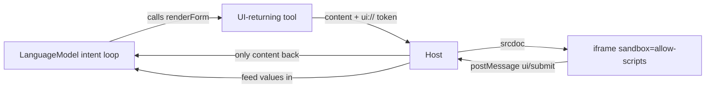

<LessonSchema
  name="Generative UI (MCP Apps)"
  description="Let a built-in AI tool return interactive UI, not text — render the markup in a sandboxed iframe, validate every postMessage, and keep ui:// from the model."
  path="/courses/chrome-built-in-ai/generative-ui"
/>

# Generative UI (MCP Apps)

So a tool returns text and you drop it into the page. Fine — until the model hands
you a `<button onclick>` and your DOM just ran it. Generative UI (MCP Apps) changes
the shape of the answer: a tool returns an interactive widget — a form, a card, a
picker — and the host renders that markup inside a sandboxed iframe instead of
trusting it. This lesson builds a UI-returning tool on top of the `LanguageModel`
intent loop, renders its output in `<iframe sandbox>`, and validates every message
the iframe sends back home.

## What you'll build

- Return interactive UI from a tool with the MCP Apps shape — `content` plus `_meta['ui.resourceUri']`, not a string.
- Render model-authored markup inside `<iframe sandbox="allow-scripts">` instead of your own DOM.
- Keep the `ui://` URI out of the model's context so it never re-reads its own render.
- Wire a `postMessage` channel home and validate the message source before trusting a single field.
- Drive the whole thing from the `LanguageModel` intent loop, and close the loop when the iframe posts back.

:::note Prerequisites
Desktop Chrome with built-in AI, and you've already wired tools in
[Structured output & tool calling](./structured-output-and-tools) and put them on
the page in [WebMCP: your page as a tool surface](./webmcp) — generative UI sits on
top of both. If `LanguageModel` isn't there yet, start with
[Setup & the availability lifecycle](./setup-and-availability); for which APIs are
stable on which Chrome, see [the compatibility matrix](./shipping-and-compatibility).
:::

Here's the whole round-trip before any code. The model calls a tool, the tool
answers with markup, the host sandboxes it, and the iframe talks back:



## Return UI, not a string

Ok. A normal tool hands the model a string and the model reads it. A
generative-UI tool hands back a whole document — and the model never reads that
part. The shape is the MCP Apps result: a `content` array the model can see, and a
`_meta['ui.resourceUri']` the host peels off to render. The tool stashes its markup
in a registry keyed by a `ui://` token and returns the token.

That's the whole contract.

<CodeTabs>
```js title="demo.js"
// A tool that returns UI stores its markup keyed by a ui:// token.
const uiRegistry = new Map();

const TOOLS = {
  // renderForm answers with the MCP Apps shape: model-readable `content`
  // PLUS a `_meta['ui.resourceUri']` the host resolves to sandboxed markup.
  renderForm(args) {
    const uri = 'ui://gen-ui/form/' + crypto.randomUUID();
    uiRegistry.set(uri, renderFormHtml(args)); // a small, self-contained HTML doc
    return {
      content: [{ type: 'text', text: 'Rendered a form.' }],
      _meta: { 'ui.resourceUri': uri },
    };
  },
};
```
```ts title="demo.ts"
// The MCP Apps (SEP-1865) result: text for the model, a token for the host.
interface UIResource {
  content: Array<{ type: 'text'; text: string }>;
  _meta: { 'ui.resourceUri': string };
}

const uiRegistry = new Map<string, string>();

const TOOLS: Record<string, (args: Record<string, unknown>) => UIResource | string> = {
  renderForm(args): UIResource {
    const uri = 'ui://gen-ui/form/' + crypto.randomUUID();
    uiRegistry.set(uri, renderFormHtml(args)); // a small, self-contained HTML doc
    return {
      content: [{ type: 'text', text: 'Rendered a form.' }],
      _meta: { 'ui.resourceUri': uri },
    };
  },
};
```
</CodeTabs>

## Render the markup in a sandboxed iframe

Here's the uncomfortable part the quickstart skips: the markup came from a language
model, and you're about to run it. So you don't run it in your page. You hand it to
a fresh document that has no access to yours — `<iframe sandbox="allow-scripts">`,
fed through `srcdoc`. You leave off `allow-same-origin`, which gives the frame a
null origin and cuts it off from your cookies, your `localStorage`, and your DOM.
Escape every field you interpolate, and ship a `Content-Security-Policy` inside the
frame on top.

Never `innerHTML` a model's output into your own tree. Never.

<CodeTabs>
```js title="demo.js"
// uiFrame is <iframe id="ui" sandbox="allow-scripts">. srcdoc, not innerHTML.
function renderResource(uri) {
  const html = uiRegistry.get(uri);
  if (!html) return;
  uiFrame.srcdoc = html; // a brand-new sandboxed document, not your DOM
}

// Anything from the model is untrusted — escape it before it becomes markup.
function escapeHtml(s) {
  return String(s == null ? '' : s)
    .replace(/&/g, '&amp;').replace(/</g, '&lt;').replace(/>/g, '&gt;')
    .replace(/"/g, '&quot;').replace(/'/g, '&#39;');
}
```
```ts title="demo.ts"
function renderResource(uri: string): void {
  const html = uiRegistry.get(uri);
  if (!html) return;
  uiFrame.srcdoc = html; // a brand-new sandboxed document, not your DOM
}

function escapeHtml(s: unknown): string {
  return String(s == null ? '' : s)
    .replace(/&/g, '&amp;').replace(/</g, '&lt;').replace(/>/g, '&gt;')
    .replace(/"/g, '&quot;').replace(/'/g, '&#39;');
}
```
</CodeTabs>

The shipped version goes one level further: a double-iframe relay, where an outer
frame holds `allow-same-origin` purely to route `postMessage` while the inner frame
that runs the model's markup stays at null origin with `allow-scripts` only. The
demo collapses that to a single sandboxed frame to keep the mechanics readable; the
production reason is the same one either way — model markup never gets same-origin
access.

## Keep ui:// out of the model's context

The tool ran, the iframe is on screen, and now the loop wants the result. Give it
the wrong thing and you poison the next turn: feed the `ui://` token back and the
model starts quoting render URLs at the user, or tries to reason about markup it was
never meant to see. So you split the result. The iframe gets the markup. The model
gets `content` and nothing else.

One branch does it, and one assert keeps you honest.

<CodeTabs>
```js title="demo.js"
const result = tool(args);

let back;
if (typeof result === 'object') {           // a UI resource, not a plain string
  renderResource(result._meta['ui.resourceUri']);
  back = JSON.stringify({ content: result.content }); // ui:// stripped here
} else {
  back = result;
}

// The invariant, made load-bearing: ui:// must never reach the model.
console.assert(!back.includes('ui://'), 'ui:// leaked into the model prompt');
```
```ts title="demo.ts"
const result: UIResource | string = tool(args);

let back: string;
if (typeof result === 'object') {           // narrowed to UIResource
  renderResource(result._meta['ui.resourceUri']);
  back = JSON.stringify({ content: result.content }); // ui:// stripped here
} else {
  back = result;                            // narrowed to string
}

console.assert(!back.includes('ui://'), 'ui:// leaked into the model prompt');
```
</CodeTabs>

## Wire the postMessage channel back

A card you can't click is a screenshot. The point of generative UI is that the
iframe talks back — a form submit, a Pick button, a chosen date — and it reaches the
host the only way a sandboxed frame can: `postMessage`. Inside the frame that's one
line on submit, `parent.postMessage({ jsonrpc: '2.0', method: 'ui/submit', params }, '*')`.

And here's the trap. A `srcdoc` sandbox has no real origin, so `event.origin` arrives
as the literal string `"null"` — the origin check every tutorial teaches you is
worthless here. You validate the source window instead: is this message actually
from my iframe? If not, drop it.

<CodeTabs>
```js title="demo.js"
window.addEventListener('message', (event) => {
  // Sandboxed srcdoc frames report event.origin === "null" — check the SOURCE.
  if (event.source !== uiFrame.contentWindow) return;
  const data = event.data;
  if (!data || data.jsonrpc !== '2.0') return; // our JSON-RPC 2.0 envelope
  if (data.method === 'ui/submit') {
    handleSubmit(data.params.values);          // trusted: it came from our frame
  }
});
```
```ts title="demo.ts"
function onFrameMessage(event: MessageEvent): void {
  if (event.source !== uiFrame.contentWindow) return; // check source, not origin
  const data = event.data as
    | { jsonrpc?: string; method?: string; params?: { values?: Record<string, string> } }
    | null;
  if (!data || data.jsonrpc !== '2.0') return;
  if (data.method === 'ui/submit') {
    void handleSubmit(data.params?.values ?? {});
  }
}
window.addEventListener('message', onFrameMessage);
```
</CodeTabs>

## Drive it from the LanguageModel loop

None of this is new machinery. It's the intent loop from tool calling, with one tool
that answers in HTML. Create the session the way you always do — `outputLanguage: 'en'`
and a system prompt that lists `renderForm`. Then loop: prompt with
`responseConstraint: INTENT_SCHEMA`, parse, run the tool, feed the result back. When
the tool returns UI, render it and hand back `content`. When the user submits, you get
a choice — round-trip the values back through the model for a confirmation, or skip
the model entirely.

That last option is the one worth stealing. In the shipped code the Pick button
never wakes the model: it calls `commitRecipeToPlan`, a tool tagged
`annotations: { visibility: ['app'] }` so it's filtered out of the model's catalog.
The model can't see it. The iframe can call it. User clicks, the row lands in the
plan, no token spent.

<CodeTabs>
```js title="demo.js"
const session = await LanguageModel.create({
  outputLanguage: 'en',                    // load-bearing — don't omit it
  initialPrompts: [{ role: 'system', content: TOOL_SYSTEM }],
});

// driveLoop prompts each turn with { responseConstraint: INTENT_SCHEMA } — { toolName, args, reply }
await driveLoop(session, 'Book me a demo slot'); // prompt → parse → run → feed → repeat

// Later, when the iframe posts ui/submit, feed the values back in:
async function handleSubmit(values) {
  await driveLoop(session, 'The user submitted ' + JSON.stringify(values) + '. Confirm it.');
}

window.addEventListener('beforeunload', () => session.destroy()); // free the GPU
```
```ts title="demo.ts"
const session = await LanguageModel.create({
  outputLanguage: 'en',
  initialPrompts: [{ role: 'system', content: TOOL_SYSTEM }],
});

// driveLoop prompts each turn with { responseConstraint: INTENT_SCHEMA }
await driveLoop(session, 'Book me a demo slot');

async function handleSubmit(values: Record<string, string>): Promise<void> {
  await driveLoop(session, 'The user submitted ' + JSON.stringify(values) + '. Confirm it.');
}

window.addEventListener('beforeunload', () => session.destroy());
```
</CodeTabs>

:::tip Try it
Run it locally: open `13-generative-ui/index.html` from the
[chrome-ai-course repo](https://github.com/danduh/chrome-ai-course) in desktop
Chrome. Or use the hosted demo: **[Generative UI](https://windowai.danduh.me/generative-ui/generative-ui-demo)**
(with its [API walkthrough](https://windowai.danduh.me/generative-ui/generative-ui-api-documentation)).

Expected: you ask the assistant to book a slot; it calls `renderForm`, and a small
form appears inside a sandboxed iframe. Fill it in and submit — the event log shows
the iframe's `ui/submit` message arriving with its source verified, and the assistant
confirms your details. No model available? The canned-example button renders the same
form and runs the whole postMessage round-trip without one.

Requires: desktop Chrome with Gemini Nano available for the assistant path — see
[Setup & the availability lifecycle](./setup-and-availability). The canned example
needs no model.
:::

## Gotchas & troubleshooting

:::caution Your origin check drops every message
Symptom: nothing arrives from the iframe, or your `event.origin` guard rejects it.
Cause: a sandboxed `srcdoc` iframe has a null origin, so `event.origin` is the string
`"null"`, never your page's origin. Fix: validate
`event.source === uiFrame.contentWindow` instead of comparing origin strings.
:::

:::caution The assistant starts quoting ui:// at the user
Symptom: replies mention `ui://gen-ui/...` URLs. Cause: you fed the whole tool result
— `_meta` included — back into `prompt()`. Fix: feed back only `content`, and keep the
`console.assert(!text.includes('ui://'))` so a regression trips in dev.
:::

:::caution The rendered UI is dead, or you're nervous it can reach your page
Symptom: buttons don't respond, or the frame feels too powerful. Cause: the sandbox
attributes. Fix: `sandbox="allow-scripts"` runs the inner script but withholds
`allow-same-origin`, so the frame can't touch your DOM or storage. Don't add
`allow-same-origin` to a frame showing model output — that hands it the keys.
:::

:::caution A crafted field breaks out of the markup
Symptom: a value injects a tag or escapes an attribute. Cause: you interpolated
model or user text into the `srcdoc` without escaping. Fix: HTML-escape every
interpolated string, and add a `Content-Security-Policy` meta inside the frame as
defense in depth.
:::

:::caution create() hangs, or GPU memory runs out
Symptom: the first `create()` never resolves, or after a few runs `create()` starts
rejecting. Cause: the first call blocks on a multi-GB model download, and orphaned
sessions hold GPU memory. Fix: wire a `monitor` and show progress (`e.loaded` is a
0..1 fraction — multiply by 100), and `destroy()` every session on teardown.
:::

## Recap

- A UI-returning tool answers with `content` plus `_meta['ui.resourceUri']` — text for the model, a token the host resolves to markup.
- The host renders that markup in `<iframe sandbox="allow-scripts">` through `srcdoc`, never in its own DOM, with escaping and a CSP on top.
- Only `content` goes back to the model; the `ui://` URI is stripped so it never re-enters the loop.
- The iframe talks back over `postMessage`, and you trust it by source, not origin, because sandboxed frames are null-origin.
- It all rides the `LanguageModel` intent loop, and app-only tools (`visibility: ['app']`) let the iframe act without a model round-trip.

Generative UI sounds like a rendering feature. It isn't. It's a trust boundary with
a form stapled to it — the model proposes markup, the iframe contains it, and
`postMessage` is the one door, watched.

An iframe is cheaper than the incident.

## Next steps

- [An MCP client in the browser](./mcp-client) — the inverse move: drive tools from a remote MCP server, not just local ones.
- [WebMCP: your page as a tool surface](./webmcp) — how tools get registered on the page in the first place.
- [Structured output & tool calling](./structured-output-and-tools) — the intent loop and `responseConstraint` schema this all rides on.
- [Generative UI API reference](https://windowai.danduh.me/generative-ui/generative-ui-api-documentation) — the hosted MCP Apps (SEP-1865) walkthrough.

---

Next: [An MCP client in the browser](./mcp-client)
