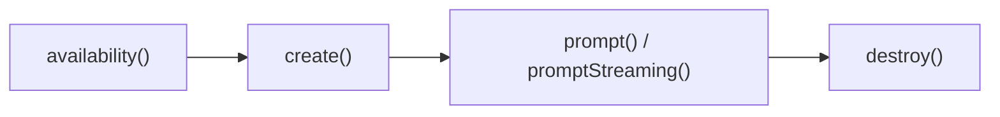

<LessonSchema
  name="Introduction: AI in the browser"
  description="Chrome's built-in AI runs Gemini Nano on-device — no backend, no keys, nothing leaves the machine. Meet the API family and the one pattern they share."
  path="/courses/chrome-built-in-ai/introduction"
/>

# Introduction: AI in the browser

Ok. Somewhere in the last year, your users' browsers quietly grew a language model. Chrome's built-in AI ships Gemini Nano — a real, instruction-tuned model, about 4 GB on disk — on every desktop install that clears the hardware bar, and hands it to your page as plain JavaScript globals. No backend. No API key. No per-token bill, and not one byte of user data leaves the machine. This lesson is the map: what built-in AI actually is, the API family you'll wire across the course, and the one four-verb pattern every single one of them shares.

## What you'll build

- Trace what "built-in AI" actually is: Gemini Nano, shipped inside Chrome, exposed as web APIs.
- Map the API family to the lessons that go deep on each one.
- Run the one lifecycle every API reuses: `availability()` → `create()` → use → `destroy()`.
- Ship a first on-device prompt that streams a reply with no backend, no key, and no bill.

:::note Prerequisites
Desktop Chrome (Windows, macOS, or Linux) with built-in AI available. If `availability()` comes back `unavailable`, start with [Setup & the availability lifecycle](./setup-and-availability); for the full version-and-flag picture, keep [the compatibility matrix](./shipping-and-compatibility) open in a tab.
:::

## What "built-in AI" actually means

So what is it. Not a cloud endpoint you hit with a key. Not a wrapper around someone's REST API. Not a model you bundle and ship yourself.

Built-in AI is a language model — Gemini Nano, 2 to 4 billion parameters depending on your hardware — sitting on the user's disk, managed by Chrome, exposed to your page through bare browser globals like `LanguageModel`. You reach for it the way you reach for `fetch` or `localStorage`. The model runs on the user's own GPU. The inference never leaves the tab.

Which means the three numbers that used to define whether an AI feature was even worth building — cost per call, round-trip latency, data-egress risk — all collapse to the same value.

Zero.

## The API family

Here's the whole surface on one screen. One general-purpose Prompt API, a set of higher-level task APIs, an embeddings layer, and an agentic layer — each row linking to the lesson that goes deep.

| API | What it does | Lesson |
|---|---|---|
| Prompt API (`LanguageModel`) | Chat-style prompting with streaming, tools, and structured output | [Prompt API](./prompt-api) |
| `Summarizer` | Compress long text to a TL;DR, key points, or a headline | [Summarizer](./summarizer) |
| `Translator` + `LanguageDetector` | Detect the language, then translate across ~50 pairs | [Translator + Language Detector](./translator-and-language-detector) |
| `Writer` / `Rewriter` | Draft new text, or change an existing text's tone, length, or formality | [Writer & Rewriter](./writer-and-rewriter) |
| `Proofreader` | Grammar and spelling fixes, with positions | [Proofreader](./proofreader) |
| Embeddings | Turn text into vectors for on-device search and similarity | [Embeddings](./embeddings) |
| Multimodal | Feed images to the model alongside text | [Multimodal](./multimodal) |
| WebMCP | Expose your page's actions as tools an agent can call | [WebMCP](./webmcp) |
| Generative UI | Let the model render UI through MCP apps | [Generative UI](./generative-ui) |
| MCP client | Drive external MCP tools from the browser | [MCP client](./mcp-client) |
| Observability & tracing | See what the model actually did, call by call | [Observability & tracing](./observability-and-tracing) |
| Evaluation | Measure whether the output is any good | [Evaluation](./evaluation) |

One model sits behind every row — Gemini Nano. The task APIs aren't separate models; they're tuned system prompts and decoder configs layered over the same weights. Download it once and the whole table lights up. A failed download breaks all of them at once.

## Why on-device — and the honest cost

So why run a model locally when GPT-5, Claude, and Gemini Ultra are all sitting in the cloud, smarter than Nano will ever be? Four reasons.

Privacy — the text never leaves the browser process, which collapses an entire category of compliance work: no data-processing agreement with an LLM vendor, no data-residency engineering, no third-party-processor disclosure for the AI step. For a fintech or a healthtech product, that legal saving dwarfs the inference saving.

Cost — a cloud call runs $0.001 to $0.10, and a local call runs $0. That's not a discount. That's a different economic model, where "summarize this on every keystroke" goes from a line item to a `for` loop.

Latency — no 200-to-2000ms round trip. About 300ms to warm a session, then tokens stream at conversational speed.

Offline — the plane, the train, the dead-zone office. The feature just works.

Now, let's be honest about the bill. It's a one-time, multi-GB model download that blocks the very first `create()` until it finishes. It's desktop only — no Android, no iOS, no ChromeOS. And it's hardware-dependent: a machine under the bar returns `unavailable` and stays there, and there's no flag you can flip to fix that for the user. Pick the tool for the job — Nano for the 80% of asks that don't need cloud-scale reasoning, the cloud for the rest. Most teams badly overestimate how often "the rest" shows up.

## The one pattern every API shares

Learn this once and you've learned all of them. Every built-in AI API — Prompt, Summarizer, Translator, the lot — walks the same four steps: ask whether it's available, create an instance, use it, then hand the memory back.



Feature-detect first, because the global is simply `undefined` on `http://` pages and on browsers that don't ship it. Then `availability()` returns exactly one of four states: `unavailable`, `downloadable`, `downloading`, or `available`. Then `create()` — declaring the languages you'll use with `expectedInputs` and `expectedOutputs`, so the model knows what's coming in and what goes back out. Then you prompt. Then you `destroy()`, because an orphaned session pins GPU memory until the tab dies.

<CodeTabs>
```js title="hello.js" {5,9-12}
if (typeof LanguageModel === 'undefined') {
  // Not desktop Chrome, or not a secure context (https / localhost).
  console.log('Built-in AI is not available here.');
} else {
  const status = await LanguageModel.availability();
  // "unavailable" | "downloadable" | "downloading" | "available"
  if (status !== 'unavailable') {
    // First run downloads ~4 GB — wire a monitor in real code (see the demo).
    const session = await LanguageModel.create({
      expectedInputs:  [{ type: 'text', languages: ['en'] }],
      expectedOutputs: [{ type: 'text', languages: ['en'] }],
    });
    const reply = await session.prompt('In one word: where does this model run?');
    console.log(reply); // e.g. "Locally."
    session.destroy();
  }
}
```
```ts title="hello.ts" {6,8-11}
type Availability = 'unavailable' | 'downloadable' | 'downloading' | 'available';

if (typeof LanguageModel === 'undefined') {
  console.log('Built-in AI is not available here.');
} else {
  const status: Availability = await LanguageModel.availability();
  if (status !== 'unavailable') {
    const session = await LanguageModel.create({
      expectedInputs:  [{ type: 'text', languages: ['en'] }],
      expectedOutputs: [{ type: 'text', languages: ['en'] }],
    });
    const reply: string = await session.prompt('In one word: where does this model run?');
    console.log(reply);
    session.destroy();
  }
}
```
</CodeTabs>

Four verbs. Every lesson after this one is a variation on those four.

:::tip Try it
Run it locally: open `01-introduction/index.html` from the [chrome-ai-course repo](https://github.com/danduh/chrome-ai-course) in desktop Chrome. Or use the hosted demo: **[windowai.danduh.me](https://windowai.danduh.me/)**.

Expected: the page reports whether Gemini Nano is available; click the button and it streams a one-sentence definition of on-device AI, then frees the session.

Requires: desktop Chrome with Gemini Nano available — check your browser at [windowai.danduh.me/status](https://windowai.danduh.me/status), or work through [Setup & the availability lifecycle](./setup-and-availability).
:::

## Gotchas & troubleshooting

Three things bite everyone on first contact. They're the same lesson wearing different hats: the model is a real, heavy, local resource, not an HTTP endpoint.

:::caution The global is undefined
Symptom: your feature-detect fails and nothing runs.

Cause: you're not on desktop Chrome, or the page is served over `http://`. These globals only exist in a secure context — `https` or `localhost`.

Fix: open the page in desktop Chrome over `https` or `localhost`, and always guard with `typeof LanguageModel !== 'undefined'` before you touch it.
:::

:::caution The first call hangs for a minute
Symptom: `create()` sits there and never resolves.

Cause: the first `create()` triggers the one-time ~4 GB model download, and it won't resolve until the download finishes.

Fix: pass a `monitor` and render `e.loaded * 100` as a progress bar (`e.loaded` is a 0..1 fraction — there's no `e.total`). Show progress; don't block the UI on a frozen button.
:::

:::caution availability() says unavailable and never changes
Symptom: the state is stuck on `unavailable` no matter what you do.

Cause: the device is under the hardware bar, on-device AI is switched off in Settings, or an enterprise policy blocks it.

Fix: this isn't a bug you can code around — degrade gracefully with a message and a cloud fallback. Don't poll `availability()` in a loop hoping it flips; polling can itself kick off a download.
:::

## How the course is structured

The course goes zero to superhero, and it climbs in layers.

Foundations first: [Setup & the availability lifecycle](./setup-and-availability) gets the model on disk and drills the state machine you just met.

Then the core: the [Prompt API](./prompt-api), [structured output and tool calling](./structured-output-and-tools), and [image input](./multimodal). That's the raw model plus everything you can make it do.

Then the task APIs — the constrained, more reliable ones. Summarizer, Translator plus Language Detector, Writer, Rewriter, Proofreader. Compress, translate, draft, fix. Each is a tuned system prompt over the same Nano weights, so it holds its shape better than asking the raw model nicely.

Then the semantic layer: [embeddings](./embeddings) for search and similarity, all on-device.

Then the agentic layer, which is where it gets loud. [WebMCP](./webmcp) turns your page into a tool surface, [generative UI](./generative-ui) lets the model render components, and an in-browser [MCP client](./mcp-client) drives external tools.

Then the part everyone skips and later regrets: the production tail. [Observability and tracing](./observability-and-tracing) so you can see what the model actually did, [evaluation](./evaluation) so you know whether it's any good, and finally [shipping and compatibility](./shipping-and-compatibility) so it survives a real browser matrix.

Foundations, core, tasks, embeddings, agents, then proof it works. That's the climb.

## Recap

So, the shape of it:

- Built-in AI is Gemini Nano — a real model shipped inside Chrome, reached through bare globals like `LanguageModel`, running on-device with no backend, no key, and no data egress.
- The API family is small: one Prompt API, a set of task APIs, embeddings, and an agentic/MCP layer — all over one model.
- On-device buys you privacy, zero marginal cost, low latency, and offline — and costs you a one-time multi-GB download, desktop-only reach, and hardware variance.
- Every API reuses one pattern: `availability()` → `create()` → use → `destroy()`.

You've been renting a model your users already own.

## Next steps

- Get the model running: [Setup & the availability lifecycle](./setup-and-availability).
- Go deep on the core: [The Prompt API (LanguageModel)](./prompt-api).
- Bookmark the reference: [the compatibility matrix](./shipping-and-compatibility) for versions, flags, and fallbacks.

---

Next: [Setup & the availability lifecycle](./setup-and-availability)
