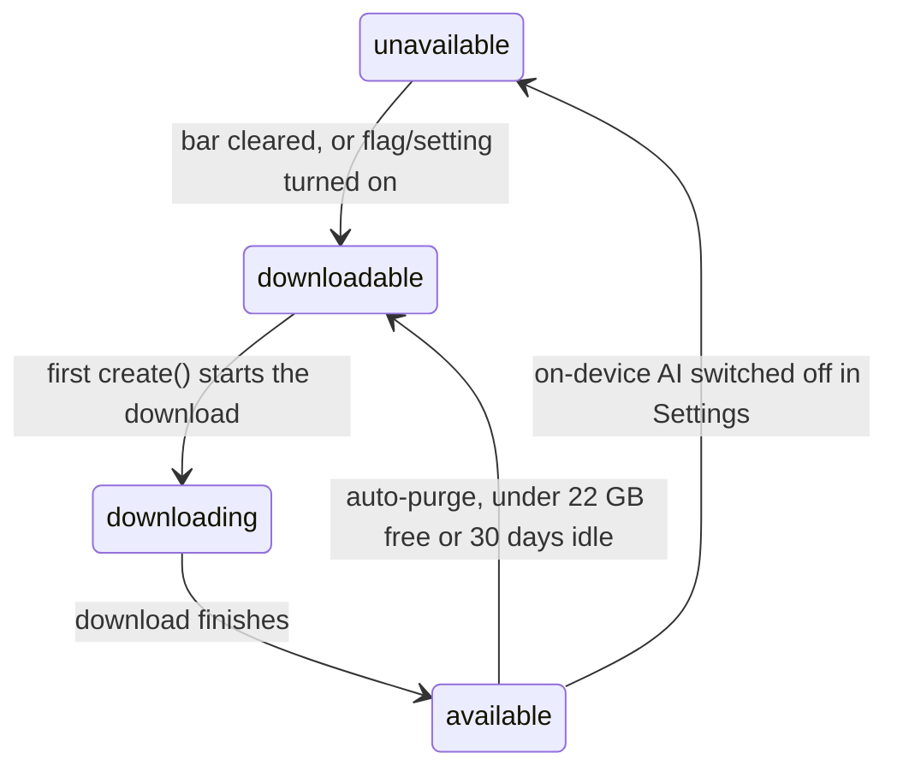

<LessonSchema
  name="Setup & the availability lifecycle"
  description="Turn on Chrome's built-in AI, watch Gemini Nano download, and handle the four availability() states so your feature never assumes the model is already there."
  path="/courses/chrome-built-in-ai/setup-and-availability"
/>

# Setup & the availability lifecycle

Ok. Setting up Chrome's built-in AI is less "npm install" and more "wait for a
multi-gigabyte model to land, then handle four different availability states
without assuming any of them." Every later lesson opens a session like the model
is just sitting there. It isn't — not on a fresh machine. This is the lesson
where you turn it on, watch Gemini Nano download, and write the availability
check every other API in the course leans on.

## What you'll build

- Turn on built-in AI with the right `chrome://flags`, and know which APIs need no flag at all on current Chrome.
- Watch the Gemini Nano download at `chrome://on-device-internals/` and find the Settings kill-switch.
- Read the four `availability()` states and map each one to what your code should do.
- Wire a `monitor(m)` so the first `create()` shows real download progress instead of hanging.
- Probe first and branch on the result, so a machine without the model degrades instead of throwing.

:::note Prerequisites
Desktop Chrome (Windows, macOS, or Linux) on a machine that can run Gemini Nano.
This is the setup lesson, so it does not assume the model is working yet — that
is the whole point. For the version-by-version picture of what is stable,
flagged, or desktop-only, keep [the compatibility matrix](./shipping-and-compatibility)
open in a tab.
:::

## Turn on built-in AI

So, the good news first: on current stable Chrome, the core APIs need no flags at
all. Prompt, Summarizer, Translator, Language Detector — all on by default since
Chrome 148, with the model downloading the first time you call `create()`. Flags
only come back for two reasons: the pre-stable APIs (`Writer`, `Rewriter`,
`Proofreader`, WebMCP), and bypassing the hardware perf bar on a machine Chrome
has decided is too weak.

When you do need them — an older channel, a locked-down dev box, or a laptop
sitting just under the bar — these are the two that matter:

1. Open `chrome://flags`.
2. Set `#optimization-guide-on-device-model` to "Enabled BypassPerfRequirement". This is the one that skips the hardware benchmark.
3. Set `#prompt-api-for-gemini-nano` to "Enabled".
4. Relaunch Chrome when it prompts you.

The task and origin-trial APIs carry their own flags —
`#summarization-api-for-gemini-nano`, `#writer-api-for-gemini-nano`, and friends
— but you only touch those on the lessons that need them.

## Watch the model download

Let's say you called `create()` and the tab just sits there. That is not a bug —
that is a multi-gigabyte model coming down the wire, and Chrome gives you exactly
zero UI for it unless you build one yourself. To watch it from the outside, open
`chrome://on-device-internals/`. That page lists the model components, their
download state, and how much disk they are eating. The old `chrome://components`
row people used to point at is gone — it was removed, so any tutorial still
sending you there is stale.

There is also an off switch, and users do flip it. Settings → System → "Turn
on-device AI on or off" kills the whole thing in one click, and enterprise policy
can do the same across a fleet. When it is off, every `availability()` call comes
back `unavailable`, and no flag you set will override it. Which is exactly why
your code checks the state instead of trusting it.

## Read the four availability states

`LanguageModel.availability()` answers one question — can I use this right now —
with exactly one of four words. Not a boolean. Not `true`/`false`. Four states,
because "is the model here" has four honest answers: no and never, not yet but it
can be, it is on its way, and yes.

- `"unavailable"` — the device is under the hardware bar, a flag or setting is off, or you are on `http://`. Treat it as permanent: degrade to a cloud path or a plain message.
- `"downloadable"` — supported, but the model is not on disk yet. The next `create()` kicks off the download.
- `"downloading"` — the model is coming down right now. `create()` resolves when it finishes; wire a `monitor` so the user sees progress.
- `"available"` — on disk and ready. `create()` returns in about 300 ms.



One edge surprises everyone: `available` is not forever. Drop under 22 GB of free
disk, or leave the model untouched for 30 days, and Chrome quietly purges it —
the state falls back to `downloadable` and the next `create()` re-downloads. A
feature that worked in your demo can be back to square one by the next sprint.

<CodeTabs>
```js title="demo.js"
if (typeof LanguageModel === 'undefined') {
  // No built-in AI here — not desktop Chrome, or an http:// page.
}

const state = await LanguageModel.availability({
  expectedInputs:  [{ type: 'text', languages: ['en'] }],
  expectedOutputs: [{ type: 'text', languages: ['en'] }],
});
// "unavailable" | "downloadable" | "downloading" | "available"
console.log(state);
```
```ts title="demo.ts"
type Availability = 'unavailable' | 'downloadable' | 'downloading' | 'available';

const state: Availability = await LanguageModel.availability({
  expectedInputs:  [{ type: 'text', languages: ['en'] }],
  expectedOutputs: [{ type: 'text', languages: ['en'] }],
});
console.log(state);
```
</CodeTabs>

## Wait out the download with monitor()

Here's the thing about the first `create()` on a fresh machine: it blocks. Not
for 300 milliseconds — for however long it takes to pull a few gigabytes over the
user's connection, and it will not resolve until that finishes. Fire it with no
feedback and your UI looks frozen, users refresh mid-download, and you get a bug
report titled "AI button does nothing."

So wire the `monitor` from the first line, not as a follow-up. Pass a
`monitor(m)` to `create()`, listen for `downloadprogress`, and read `e.loaded` —
a fraction from 0 to 1. Multiply by 100 for a percentage. There is no `e.total`
in current builds, so don't reach for it.

<CodeTabs>
```js title="demo.js"
const session = await LanguageModel.create({
  expectedInputs:  [{ type: 'text', languages: ['en'] }],
  expectedOutputs: [{ type: 'text', languages: ['en'] }],
  monitor(m) {
    m.addEventListener('downloadprogress', (e) => {
      // highlight-next-line
      const pct = Math.round(e.loaded * 100); // e.loaded is 0..1, no e.total
      progressEl.value = e.loaded;
      statusEl.textContent = `Downloading Gemini Nano… ${pct}%`;
    });
  },
});
// create() only resolves once the download is done.
```
```ts title="demo.ts"
const session = await LanguageModel.create({
  expectedInputs:  [{ type: 'text', languages: ['en'] }],
  expectedOutputs: [{ type: 'text', languages: ['en'] }],
  monitor(m: AICreateMonitor) {
    m.addEventListener('downloadprogress', (e: ProgressEvent) => {
      // highlight-next-line
      const pct = Math.round(e.loaded * 100); // e.loaded is 0..1, no e.total
      progressEl.value = e.loaded;
      statusEl.textContent = `Downloading Gemini Nano… ${pct}%`;
    });
  },
});
```
</CodeTabs>

## Check the hardware bar

Let's be honest about who this actually runs for. Built-in AI is desktop-only and
hardware-gated, and no amount of clever code changes that. The bar, as it stands:

- Desktop only: Windows 10 or newer, macOS 13 or newer, or Linux. No Android, no iOS, no ChromeOS.
- Around 22 GB of free disk. Drop under that and Chrome purges the roughly 4 GB model — the auto-purge edge from the diagram above.
- A GPU with over 4 GB of VRAM, or a machine on the 16 GB-RAM tier.
- A non-metered network connection for the one-time download.
- A secure context — `https` or `localhost`. On `http://` the globals are simply `undefined`.

A machine under the bar returns `unavailable` and stays there. That is not a
state you retry your way out of — it is a "use the cloud, or tell the user to
switch to a desktop" decision. Plan the fallback before you plan the feature.

## Probe first, then branch

Now let's put it together, because the whole lesson collapses into one rule:
check the state, then act on it. Never assume `available`. Feature-detect the
global, call `availability()`, branch on the answer, and only create a session
when the model is actually reachable — declaring your languages with
`expectedInputs` and `expectedOutputs` when you do, then calling `destroy()` the
moment you are done so you are not pinning GPU memory for a tab nobody is
looking at.

<CodeTabs>
```js title="demo.js"
async function setupLanguageModel() {
  if (typeof LanguageModel === 'undefined') {
    return degrade('No built-in AI on this browser.');
  }

  const state = await LanguageModel.availability({
    expectedInputs:  [{ type: 'text', languages: ['en'] }],
    expectedOutputs: [{ type: 'text', languages: ['en'] }],
  });
  if (state === 'unavailable') {
    return degrade('This device cannot run Gemini Nano.');
  }

  // downloadable / downloading / available all mean create() will work —
  // wire a monitor so the first run shows progress instead of hanging.
  const session = await LanguageModel.create({
    expectedInputs:  [{ type: 'text', languages: ['en'] }],
    expectedOutputs: [{ type: 'text', languages: ['en'] }],
    monitor(m) {
      m.addEventListener('downloadprogress', (e) => {
        statusEl.textContent = `Downloading… ${Math.round(e.loaded * 100)}%`;
      });
    },
  });

  const reply = await session.prompt('Reply with the single word: ready');
  // highlight-next-line
  session.destroy(); // free GPU memory the moment you are done
  return reply;
}
```
```ts title="demo.ts"
type Availability = 'unavailable' | 'downloadable' | 'downloading' | 'available';

async function setupLanguageModel(): Promise<string> {
  if (typeof LanguageModel === 'undefined') {
    return degrade('No built-in AI on this browser.');
  }

  const state: Availability = await LanguageModel.availability({
    expectedInputs:  [{ type: 'text', languages: ['en'] }],
    expectedOutputs: [{ type: 'text', languages: ['en'] }],
  });
  if (state === 'unavailable') {
    return degrade('This device cannot run Gemini Nano.');
  }

  const session = await LanguageModel.create({
    expectedInputs:  [{ type: 'text', languages: ['en'] }],
    expectedOutputs: [{ type: 'text', languages: ['en'] }],
    monitor(m: AICreateMonitor) {
      m.addEventListener('downloadprogress', (e: ProgressEvent) => {
        statusEl.textContent = `Downloading… ${Math.round(e.loaded * 100)}%`;
      });
    },
  });

  const reply: string = await session.prompt('Reply with the single word: ready');
  // highlight-next-line
  session.destroy(); // free GPU memory the moment you are done
  return reply;
}
```
</CodeTabs>

That one function is the spine of every demo in this course. Copy it, then change
what happens after `create()`.

:::tip Try it
Run it locally: open `02-setup-and-availability/index.html` from the
[chrome-ai-course repo](https://github.com/danduh/chrome-ai-course) in desktop
Chrome. Or use the hosted browser check:
**[windowai.danduh.me/status](https://windowai.danduh.me/status)**.

Expected: the panel reports your `availability()` state in plain colour — green
when the model is ready. If it needs downloading, a button runs `create()` and
fills a progress bar from `e.loaded`; once it is ready, a one-word test prompt
proves the round trip works.

Requires: desktop Chrome on a machine that clears the Gemini Nano hardware bar.
If it cannot, the panel tells you which state you are in and links back here.
:::

## Gotchas & troubleshooting

Most of the pain here is the same misunderstanding wearing different hats: the
model is a real, heavy, local resource with its own lifecycle, not an HTTP
endpoint that is always up.

:::caution create() hangs and never resolves
Symptom: the first `create()` sits there forever with no error.

Cause: the multi-gigabyte model is downloading, and you wired no `monitor`, so
there is nothing to wait on and nothing to show.

Fix: always pass `monitor(m)` and read `e.loaded` (a 0..1 fraction) for progress.
`create()` resolves when the download finishes — it is working, it is just slow.
:::

:::caution The progress bar reads 100000% or barely moves
Symptom: your percentage is wildly wrong.

Cause: you treated `e.loaded` as a byte count or an already-scaled percentage. It
is a fraction from 0 to 1, and there is no `e.total` in current builds.

Fix: render `Math.round(e.loaded * 100)` for the number, and feed `e.loaded`
straight into a `<progress max="1">`.
:::

:::caution availability() is stuck on unavailable
Symptom: the state never leaves `unavailable`, whatever you do.

Cause: the device is under the hardware bar, on-device AI is switched off in
Settings → System, an enterprise policy blocks it, or the page is on `http://`.

Fix: this is not a bug you code around — degrade with a message and a cloud
fallback. And do not poll `availability()` in a loop hoping it flips; a probe can
itself trigger a download.
:::

:::caution It worked last month, now it is downloadable again
Symptom: a feature that shipped fine is suddenly re-downloading the model.

Cause: Chrome auto-purged Gemini Nano — the disk dropped under 22 GB free, or no
API touched the model for 30 days.

Fix: expect it. Keep the `monitor` and the download UI wired permanently, not
just for first run, so the re-download path looks the same as the first one.
:::

:::caution GPU memory climbs and other features stall
Symptom: after a while the page feels heavy and other model calls slow down.

Cause: you created sessions and never released them — each orphaned session pins
real GPU memory until the tab dies.

Fix: call `session.destroy()` when you are done, and wire it to teardown with
`window.addEventListener('beforeunload', …)`.
:::

## Recap

So, the shape of setup:

- The core APIs need no flags on current Chrome; `#optimization-guide-on-device-model` ("Enabled BypassPerfRequirement") and `#prompt-api-for-gemini-nano` are for older channels and the perf bar.
- Watch the download at `chrome://on-device-internals/`; users kill it at Settings → System, and that forces `unavailable`.
- `availability()` returns `unavailable`, `downloadable`, `downloading`, or `available` — and `available` can auto-purge back to `downloadable`.
- The first `create()` blocks on a multi-GB download; a `monitor` reading `e.loaded * 100` is how it stops looking frozen.
- Built-in AI is desktop-only, hardware-gated, and secure-context-only, so you probe and branch — you never assume.

Skip the check and you have shipped a feature that runs on exactly one machine. Yours.

## Next steps

- [The Prompt API (LanguageModel)](./prompt-api) — the model is on disk now, so open a session and start prompting.
- [Shipping & compatibility](./shipping-and-compatibility) — the full version, flag, and browser-support matrix behind this lesson.
- [Introduction: AI in the browser](./introduction) — the API family and the shared four-verb pattern, if you jumped straight here.

---

Next: [The Prompt API (LanguageModel)](./prompt-api)
